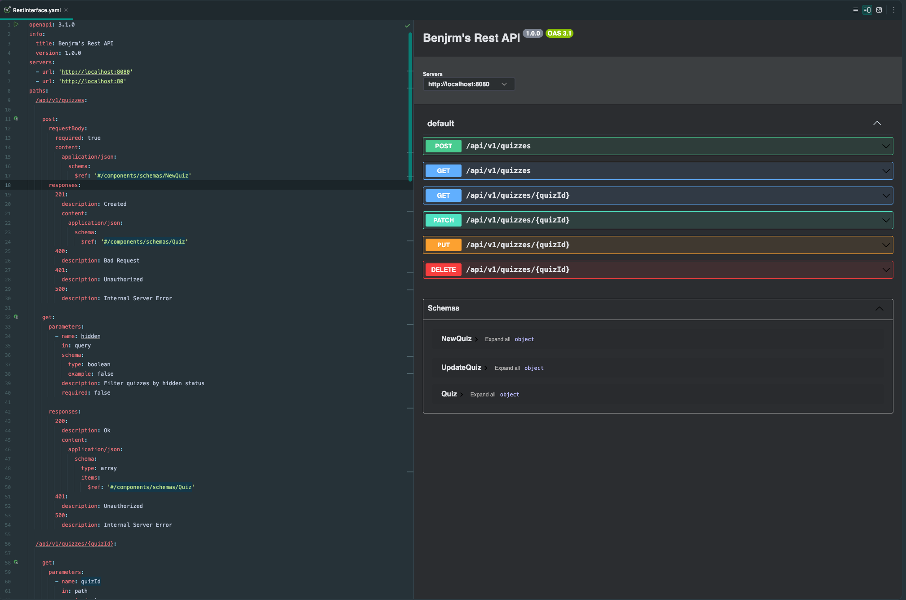
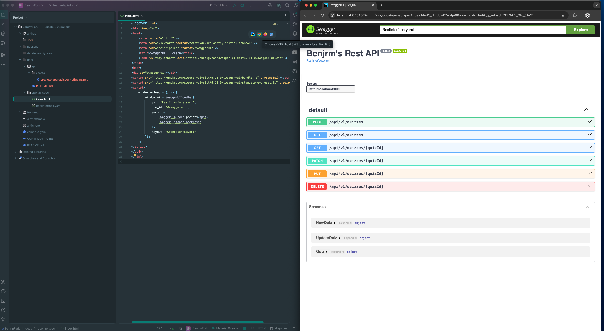

# API-related documentation

[Go back to documentation overview](../../README.md)

## OpenAPI Specification (OAS)
- Industry-standard format (a YAML or JSON file) for describing RESTFUL APIs.
- Defines your API's endpoints, parameters, request/response formats, and more.
- Acts as a machine-readable contract between your API and its consumers.
- Because it is machine-readable, it can be used to automatically generate
  documentation (like *Swagger UI*), client and server code (like *Swagger Codegen*) and even test cases (like *Dredd*).

## Swagger
- Eefers to the tooling ecosystem (like Swagger UI, Swagger Editor, and Swagger Codegen)
  that helps you design, visualize, and interact with APIs based on that spec.

### API documentation with *Swagger UI*

1. Every API endpoint is documented within the [OpenAPI Specification (OAS)](../openapispec/RestInterface.yaml)

2. OpenAPI Specification (OAS) can be previewed in JetBrains IDEs

3. Swagger UI displays the OpenAPI Specification (OAS) in an interactive format
and gets automatically deployed to GitHub Pages when the `main` branch is updated *and* files *either*
in the `docs/openapispec/**` directory *or* the workflow file `.github/workflows/openapispec.yaml` are cahanged.

> For further details on how the OpenAPI Specification (OAS) is deployed to GitHub Pages in an interactive format using
> Swagger UI, please refer to the [GitHub Actions workflow file](../../.github/workflows/openapispec.yaml).
