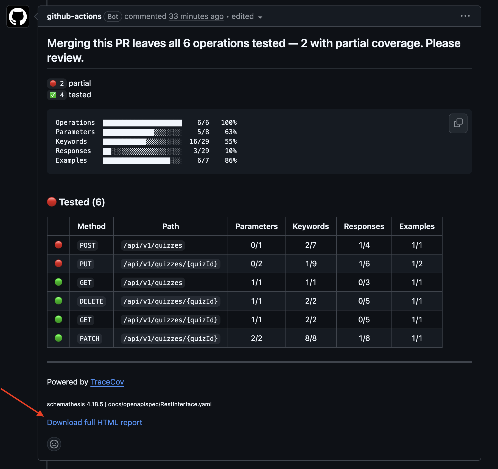
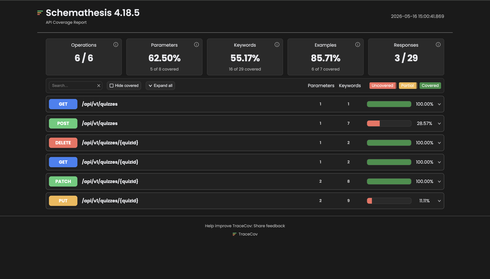

## API-first development with *Schemathesis*

Schemathesis ensures that your API implementation matches your OpenAPI or GraphQL schema by automatically generating property-based tests and uncovering edge cases and inconsistencies early.

In general, *Schemathesis* automatically generates property-based tests from your
OpenAPI or GraphQL schema and exercises the edge cases that break your API.

For detailed documentation please refer to [Schemathesis' official documentation](https://schemathesis.readthedocs.io/en/stable/).

1. GitHub Actions tests the API with *Schemathesis* when you create
   a *pull request* modifying *either* the [OpenAPI Specification](../openapispec), the
   [API implementation itself](../../backend) or the corresponding [workflow file](../../.github/workflows/schemathesis.yaml).

> For further details on how the *Schemathesis* GitHub Action works,
> please refer to the [GitHub Actions workflow file](../../.github/workflows/schemathesis.yaml).

2. Each run generates multiple coverage reports including a **PR comment** and an **HTML report** uploaded as a workflow artifact. 
Moreover, a summary in the Actions step log is also provided.

