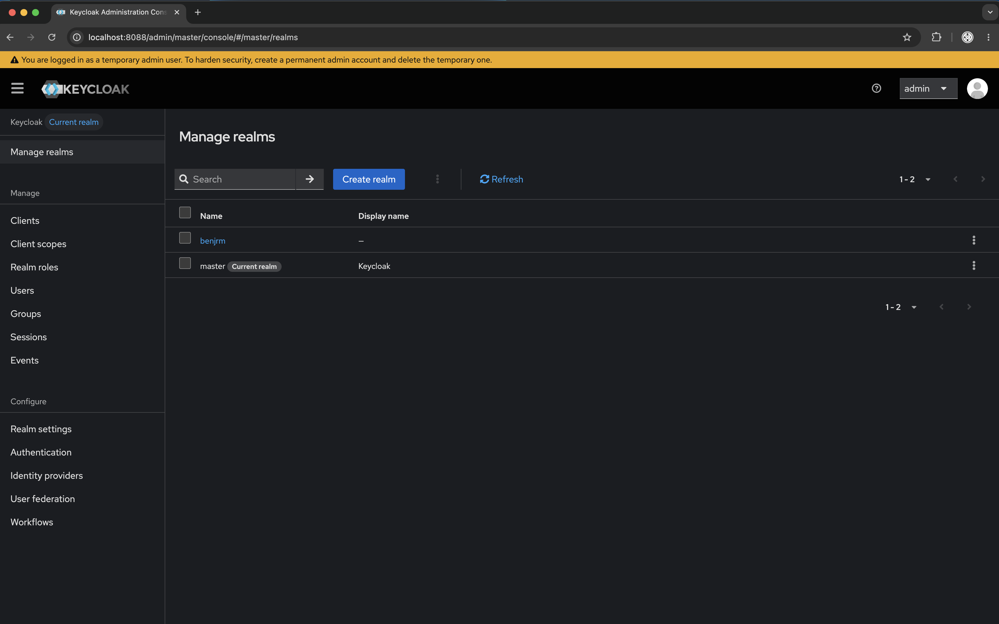
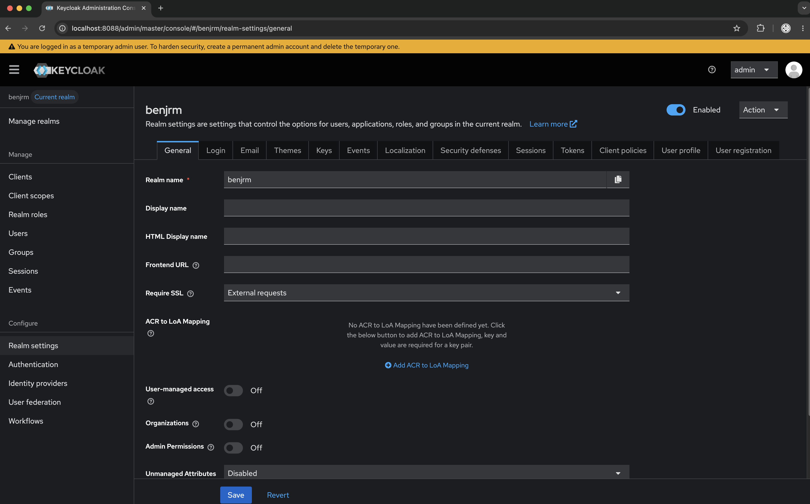
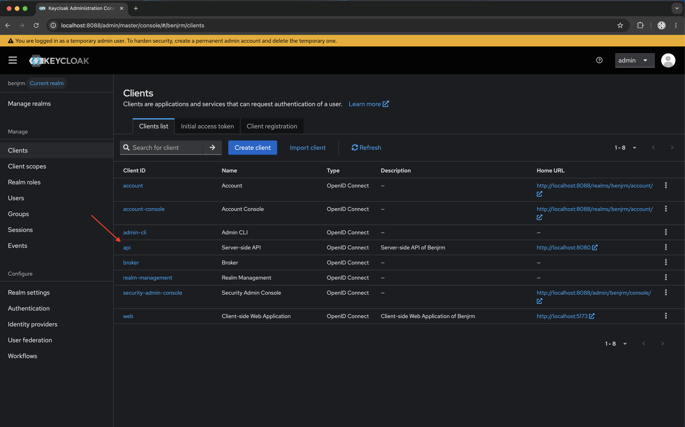
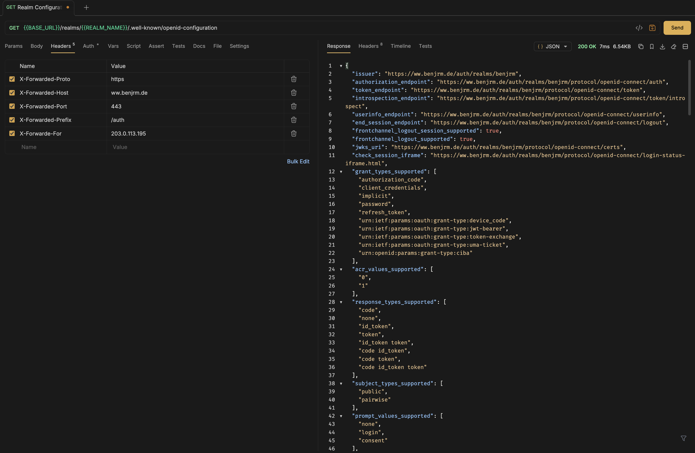
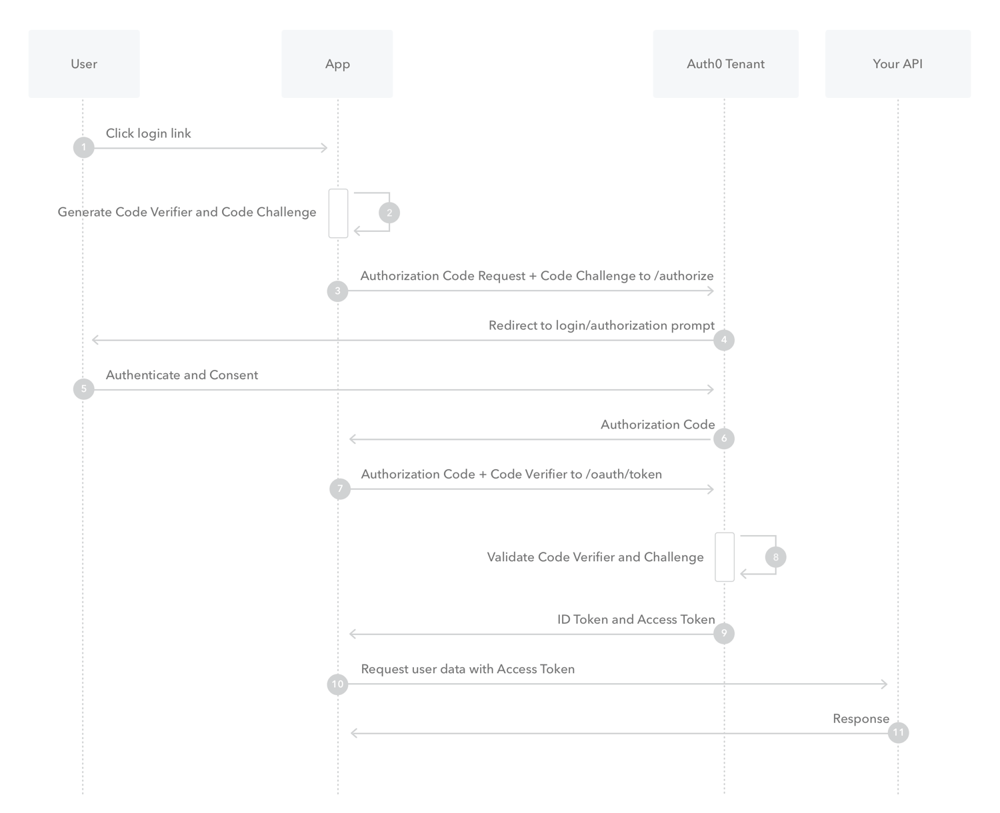

# Identity Provider - Keycloak

## Resources:
1. [JSON Schema for Keycloak Import/Export - GitHub Repository](https://github.com/jirutka/keycloak-json-schema)
2. [All configuration options for Keycloak](https://www.keycloak.org/server/all-config)
3. [Observability - Health Check endpoints](https://www.keycloak.org/observability/health)
4. [Securing applications and services with OpenID Connect](https://www.keycloak.org/securing-apps/oidc-layers)
5. [Authorization Code Flow](https://auth0.com/docs/get-started/authentication-and-authorization-flow/authorization-code-flow)
6. [Authorization Code Flow with Proof Key for Code Exchange (PKCE)](https://auth0.com/docs/get-started/authentication-and-authorization-flow/authorization-code-flow-with-pkce)
7. [Client Credentials Code Flow](https://auth0.com/docs/get-started/authentication-and-authorization-flow/client-credentials-flow)
8. [Configuring the management interface](https://www.keycloak.org/server/management-interface)
9. [Configuring the hostname (v2)](https://www.keycloak.org/server/hostname)
10. [Configuring a reverse proxy](https://www.keycloak.org/server/reverseproxy)

## Starting Keycloak with the provided configuration:

### Starting Keycloak in development mode + Providing testusers configurable via `REPOSITORY_ROOT/services/identity-provider/mounts/init.sh`:
```bash
docker compose -f compose.dev.yaml up --build
```
### Starting Keycloak in production mode without testusers:
```bash
docker compose up --build
```
> Note: Use --build option to build images before starting containers.
> This ensures that any changes to the Dockerfiles or realm configuration are included in the new images.

## Exposed Ports:
1. **Port 8088**: Admin UI, Account Console, SAML and OIDC endpoints, Admin REST API. See details about in
[Configuring the hostname (v2)](https://www.keycloak.org/server/hostname)
2. **Port 9000**: [Management interface](https://www.keycloak.org/server/management-interface)
providing [health check endpoints](https://www.keycloak.org/observability/health) and [metrics](https://www.keycloak.org/observability/configuration-metrics)
if enabled in the configuration. Note that only the health check endpoints are currently enabled in the provided Keycloak configuration.
*Note: You should not proxy port 9000 as health checks and metrics use those ports directly, and you do not want to expose this information to external callers.*
## Admin interface
1. Changing the realm from `master` to `benjrm`

2. For realm settings like `Login screen customization`, `Email settings` and `User profile settings` refer to benjrm's realm settings

3. For client settings with corresponding OIDC authentication flows refer to benjrm's client settings.


## Hostname Configuration
[Configuring the hostname (v2)](https://www.keycloak.org/server/hostname#_using_a_reverse_proxy)

### Using a reverse proxy with edge TLS termination
In the setup we use a reverse proxy with edge TLS termination 
[See details about configuring a reverse proxy for Keycloak](https://www.keycloak.org/server/reverseproxy)

#### Fully dynamic URLs
We chose a fully dynamic URL configuration to ensure maximum flexibility across different environments, specifically development and production. 
Since both environments may differ in domain, protocol, or routing behavior, hardcoding a fixed hostname would introduce unnecessary coupling and reduce portability.

By relying on correctly configured Forwarded headers from the reverse proxy, the application can automatically resolve the correct external URL at runtime. 
This allows the same deployment artifact to be used in both environments without modification, reducing configuration overhead and minimizing the risk of environment-specific misconfigurations.

Additionally, this approach supports modern infrastructure patterns such as containerization and infrastructure-as-code, where environments are expected to be ephemeral or dynamically provisioned. It also simplifies CI/CD pipelines, as no environment-specific hostname configuration is required within the application itself.

Overall, the fully dynamic approach improves maintainability, reduces duplication of configuration, and ensures consistent behavior across development and production environments while delegating URL resolution to the trusted reverse proxy layer.

[Configuring the hostname (v2) - Using a reverse proxy - Fully dynamic URLS](https://www.keycloak.org/server/hostname#_fully_dynamic_urls)


Required http headers for reverse proxy configuration:
1. `X-Forwarded-Proto`: The protocol used by the client to connect to the reverse proxy (e.g. `http` or `https`).
2. `X-Forwarded-Host`: The original host requested by the client in the host http header. (e.g. `idp.benjrm.de`).
3. `X-Forwarded-Port`: The port on which the client is connecting to the reverse proxy (e.g. `80 for http`, `443 for https`).
4. `X-Forwarded-Prefix`: The path prefix used by the reverse proxy to route requests to Keycloak (e.g. `/auth`)
5. `X-Forwarded-For`: The original client ip address of the client connecting to the reverse proxy (e.g. `203.0.113.195`).

#### Hostname Debug endpoint with dynamic URL and X-Forwarded-* http headers.

Note: This endpoint is only available when the environment variable `KC_HOSTNAME_DEBUG` is set to `true`.


#### OIDC Configuration endpoints with dynamic URL and X-Forwarded-* http headers



> Note: Take a look at
[Configuring a reverse proxy - Exposed path recommendations](https://www.keycloak.org/server/reverseproxy#_exposed_path_recommendations) and
[Configuring a reverse proxy - Trusted proxies](https://www.keycloak.org/server/reverseproxy#_trusted_proxies) when
configuring the reverse proxy.

## Overview of the Keycloak Authentication process from user perspective:
1. The user accesses the client-side web application and gets redirected to the
login page after clicking the corresponding button.
2. On the login page, the user either enters their credentials to log in or clicks the "Register" link to create a new account.
The user has the option to check the "Remember Me" checkbox to stay logged in between browser restarts until the session expires.
3. In case of forgotten credentials, the user can click the "Forgot Password?" link to initiate the password reset process,
which will send a password reset email to the user's verified registered email address.
4. If the user clicks the "Register" link, they will be taken to the registration page where they can create a new account 
by providing the required information such as username, email, and password.
After successful registration, the user will receive a verification email to confirm their email address.


## Realm Configuration
1. **"realm": "benjrm"** - 
A realm manages a set of users, credentials, roles, and groups.
A user belongs to and logs into a realm.
Realms are isolated from one another and can only manage and authenticate the users that they control.
2. **"enabled": true** -
Disabled realms cannot be accessed or used for authentication, and users within the realm cannot log in or perform any actions until the realm is enabled again.
3. **"sslRequired": "external"** - 
localhost (via 127.0.0.1.) and private IP addresses can access without HTTPS but all other requests must use HTTPS.
4. **"registrationAllowed": true** -
Enable/disable the registration page. A link for registration will show on the login page too.
5. **"resetPasswordAllowed": true** -
Show a link on the login page for users who have forgotten their credentials.
6. **"verifyEmail": true** -
Require user to verify their email address after initial login or after address changes are submitted.
7. **"rememberMe": true** -
   Show checkbox on login page to allow user to remain logged in between browser restarts until session expires.
7. **"smtpServer": { ... }** -
Configuration for sending emails from Keycloak, such as verification emails, password reset emails, and other.
8. **"smtpServer.from": "noreply@benjrm.de"** -
The email address that appears in the "From" field of emails sent by Keycloak.
9. **"smtpServer.host": "smtp.ionos.de"** -
The hostname of the SMTP server that Keycloak will use to send emails.
10. **"smtpServer.port": "465"** -
The port number on which the SMTP server is listening for secure connections (SSL/TLS).
11. **"smtpServer.ssl": "true"** -
Indicates that Keycloak should use SSL/TLS to connect to the SMTP server for secure email transmission.
12. **"smtpServer.auth": "true"** -
Indicates that Keycloak should authenticate with the SMTP server using the provided credentials (username and password) before sending emails.
13. **"smtpServer.user": "noreply@benjrm.de"** -
Indicates the username that Keycloak should use to authenticate with the SMTP server when sending emails.
14. **"smtpServer.password": "SECRET"** -
Indicates the password that Keycloak should use to authenticate with the SMTP server when sending emails.

## Client Configuration
### Server-side Application of Benjrm
Uses **OpenID Connect (OIDC)** **Standard Flow (Authorization Code Flow) with PKCE (Proof Key for Code Exchange)**
to authenticate users and obtain access tokens for accessing protected resources.
The client is configured as a confidential client, which means it requires a client secret to authenticate.
---
#### 🔐 Authorization Code Flow with Proof Key for Code Exchange (PKCE) - Step-by-Step

##### 👉Authentication Code Flow Sequence Diagram:


[Authorization Code Flow - Further explanations](https://auth0.com/docs/get-started/authentication-and-authorization-flow/authorization-code-flow)

##### 👉Authentication Code Flow Sequence Diagram with Proof Key for Code Exchange (PKCE):


[Authorization Code Flow with Proof Key for Code Exchange (PKCE) - Further explanations](https://auth0.com/docs/get-started/authentication-and-authorization-flow/authorization-code-flow-with-pkce)
